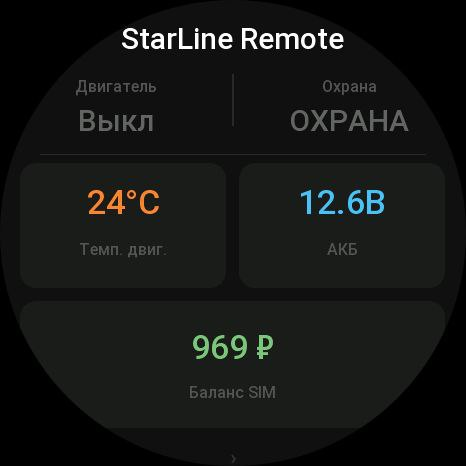
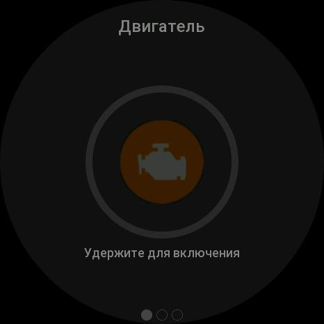
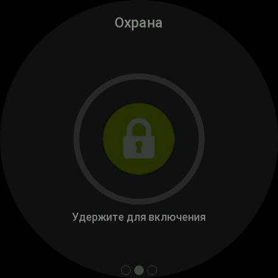
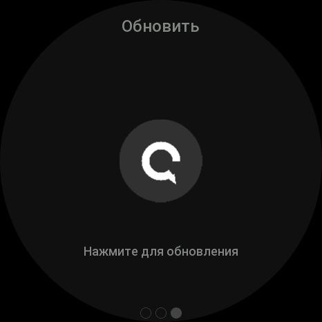
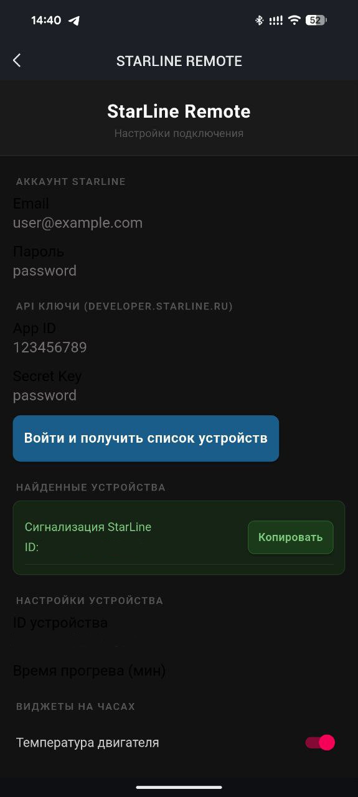

# StarLine Remote — Amazfit GTR 4

> **Неофициальный** инструмент для личного использования. Не аффилирован с компанией StarLine и не является официальным продуктом.

Управление сигнализацией **StarLine S96 / S9** с умных часов **Amazfit GTR 4** (Zepp OS 2.0).

Запуск двигателя, постановка/снятие с охраны, температура двигателя, напряжение АКБ и баланс SIM — всё прямо с запястья.

---

## Скриншоты

| Главный экран | Двигатель | Охрана | Обновить | Настройки |
|:---:|:---:|:---:|:---:|:---:|
|  |  |  |  |  |
| Статус, метрики | Удержание 3с для запуска | Удержание 3с для охраны | Обновить статус | Аккаунт, устройства, виджеты |

---

## Отказ от ответственности

**Читайте внимательно перед использованием.**

- Этот проект использует [официальный StarLine Open API](https://developer.starline.ru/) на условиях, установленных компанией StarLine. Согласно их условиям: *«Компания StarLine полностью снимает с себя ответственность за вред, причиненный вам и вашему автомобилю посредством неправильного использования API»*.
- Проект предназначен **исключительно для личного использования** с собственным устройством и собственными учётными данными. Распространение или публикация приложения для широкой аудитории **требует отдельного договора с компанией StarLine**.
- Авторы проекта **не несут никакой ответственности** за любой ущерб — материальный, механический или иной — возникший в результате использования этого программного обеспечения.
- Вы используете данный инструмент **на свой страх и риск**. Убедитесь, что понимаете, какие команды отправляются на ваш автомобиль, прежде чем их использовать.
- Удалённый запуск двигателя может быть **незаконным в вашей юрисдикции** или нарушать условия страхового полиса — проверьте законодательство вашей страны/региона.
- Используйте **собственные** App ID и Secret Key, полученные на [developer.starline.ru](https://developer.starline.ru). Никогда не передавайте их третьим лицам.

---

## Возможности

- **Запуск / остановка двигателя** — удержание кнопки 3 секунды с анимацией прогресса
- **Охрана** — постановка и снятие удержанием кнопки
- **Статус** — состояние двигателя, режим охраны на главном экране
- **Температура двигателя** — показания с датчика StarLine
- **Напряжение АКБ** — контроль заряда аккумулятора
- **Баланс SIM-карты** — остаток на счёте встроенной SIM
- **Виброотклик** — подтверждение выполнения или ошибки команды
- **Кеш токена** — slnet-сессия кешируется на 23 часа, обновляется автоматически
- **Многоэкранный UI** — главный экран (статус + метрики), три экрана управления (свайп влево): двигатель, охрана, обновить
- **Защита от случайного нажатия** — команда срабатывает только после 3 секунд удержания
- **Гибкость** — каждый виджет (температура, АКБ, баланс) включается/выключается в настройках

---

## Архитектура

```
[Amazfit GTR 4 — Device App]
         ↕ Bluetooth LE (MessageBuilder)
[Смартфон — Zepp App — Side Service]
         ↕ HTTPS
[StarLine Cloud API — dev.starline.ru]
         ↕
[StarLine S96 / S9 в машине]
```

Часы **не имеют прямого доступа в интернет** — все HTTP-запросы идут через Side Service внутри приложения Zepp на телефоне. Телефон должен находиться в зоне Bluetooth от часов (~10 м).

---

## Требования

| Компонент | Версия |
|---|---|
| Amazfit GTR 4 | Zepp OS 2.0 / API Level 2.0 |
| Zepp App | Android / iOS — с включённым Режимом разработчика |
| Zeus CLI | `npm install -g @zeppos/zeus-cli` |
| Node.js | >= 18 |

Также необходимо:
- Аккаунт на [my.starline.ru](https://my.starline.ru) с привязанным устройством S96 / S9
- **Собственные** App ID и Secret Key, полученные на [developer.starline.ru](https://developer.starline.ru) — каждый пользователь регистрирует своё приложение самостоятельно
- Аккаунт разработчика на [console.zepp.com](https://console.zepp.com) — для сборки и установки через Zeus CLI

> **Важно:** аккаунт на console.zepp.com и аккаунт Zepp App на телефоне **должны быть одними и теми же**. Zeus авторизуется через этот аккаунт, и только под ним можно устанавливать приложение в режиме разработчика на часы.

> **Важно:** никогда не используйте чужие App ID / Secret Key. Регистрация на developer.starline.ru бесплатна и занимает несколько минут. Использование чужих ключей нарушает условия StarLine API.

---

## Установка и запуск

### 1. Клонировать репозиторий

```bash
git clone https://github.com/HuaweiDonor/zepp-starline.git
cd zepp-starline
npm install
```

### 2. Зарегистрироваться и авторизоваться в Zeus

Зарегистрируйтесь на [console.zepp.com](https://console.zepp.com) и войдите через Zeus CLI
**тем же аккаунтом**, который используется в приложении Zepp App на телефоне:

```bash
npx @zeppos/zeus-cli@latest login
```

> Если аккаунты разные — установка через `zeus preview` завершится ошибкой.

### 3. Собрать приложение

```bash
npm run build
```

### 4. Установить на часы

Включить **Режим разработчика** в Zepp App: Профиль → несколько тапов по номеру версии.

```bash
npm run preview
# Выбрать: Amazfit GTR 4
# Отсканировать QR-код в Zepp App
```

---

## Настройка (Settings App)

После установки открыть **Настройки** приложения в Zepp App:

| Поле | Описание |
|---|---|
| Email | Логин аккаунта StarLine (my.starline.ru) |
| Пароль | Пароль от аккаунта StarLine |
| App ID | **Ваш личный** ID приложения с developer.starline.ru |
| Secret Key | **Ваш личный** секретный ключ с developer.starline.ru |
| — | Нажать **«Войти и получить список устройств»** |
| ID устройства | Нажать **«Копировать»** рядом с нужным устройством — ID вставится автоматически |
| Время прогрева | Таймер прогрева в минутах (по умолчанию 10) |
| Виджеты | Включить/выключить отображение температуры, АКБ, баланса |

---

## Структура проекта

```
starline-zepp/
├── app.js                          # Точка входа, инициализация MessageBuilder
├── app.json                        # Манифест приложения
├── assets/app/
│   ├── icon.png                    # Иконка приложения
│   ├── cover.png                   # Обложка для Zepp App
│   ├── btn_engine_off.png          # Иконка кнопки двигателя (выкл)
│   ├── btn_engine_on.png           # Иконка кнопки двигателя (вкл)
│   ├── btn_alarm_off.png           # Иконка кнопки охраны (снята)
│   ├── btn_alarm_on.png            # Иконка кнопки охраны (активна)
│   └── btn_refresh.png             # Иконка кнопки обновления
├── device-app/
│   ├── pages/
│   │   ├── main.js                 # Главный экран: статус и метрики (свайп влево → управление)
│   │   ├── actions_engine.js       # Экран: запуск/остановка двигателя (hold 3s)
│   │   ├── actions_alarm.js        # Экран: постановка/снятие охраны (hold 3s)
│   │   └── actions_refresh.js      # Экран: обновление статуса
│   └── shared/
│       ├── message.js              # MessageBuilder (device-side BLE)
│       ├── device-polyfill.js      # Promise polyfill для Zepp OS
│       ├── es6-promise.js          # ES6 Promise implementation
│       ├── defer.js                # Deferred / timeout helpers
│       └── data.js                 # Buffer ↔ JSON helpers
├── side-service/
│   ├── index.js                    # HTTP-клиент: авторизация StarLine, команды
│   └── shared/
│       ├── message-side.js         # MessageBuilder (phone-side BLE)
│       ├── event.js                # EventBus
│       ├── defer.js                # Deferred / timeout helpers
│       └── data.js                 # Buffer ↔ JSON helpers
├── settings-app/
│   └── index.js                    # Настройки: credentials, выбор устройства, виджеты
├── docs/
│   ├── watch_01.jpg                # Скриншот: главный экран (статус + метрики)
│   ├── watch_02.jpg                # Скриншот: экран управления (кнопки hold)
│   └── phone.jpg                   # Скриншот: настройки в Zepp App
├── scripts/
│   └── make_icons.py               # Генерация иконок кнопок (PNG 120×120)
└── .github/workflows/
    └── build.yml                   # CI: сборка ZAB и GitHub Release
```

---

## StarLine API

Используется официальный REST API [developer.starline.ru](https://developer.starline.ru). Авторизация — 4 шага:

```
1a. GET  id.starline.ru/apiV3/application/getCode
        ?appId=...&secret=MD5(secret_key)
        → {state:1, desc: {code: "..."}}

1b. GET  id.starline.ru/apiV3/application/getToken
        ?appId=...&secret=MD5(secret_key + appCode)
        → {state:1, desc: {token: "..."}}

2.  POST id.starline.ru/apiV3/user/login
        Content-Type: application/x-www-form-urlencoded
        Header: token: <appToken>
        Body: login=<email>&pass=SHA1(password)
        → {state:1, desc: {user_token: "...", user_id: N}}

3.  POST developer.starline.ru/json/v2/auth.slid
        Content-Type: application/json
        Body: {"slid_token": "<user_token>"}
        → Set-Cookie: slnet=...   (сессионный токен на 24 часа)
```

Статус устройства (`/json/v3/device/{id}/data`):

```
GET developer.starline.ru/json/v3/device/{id}/data
Cookie: slnet=...

→ {
    code: "200",
    data: {
      state:   { r_start: bool, arm: bool, ... },
      common:  { etemp: N, ctemp: N, battery: N, ... },
      balance: [ {key: "active", value: "N.NN ₽"}, ... ],
      ...
    }
  }
```

| Поле | Путь в JSON | Описание |
|---|---|---|
| Двигатель | `data.state.r_start` | `true` = запущен удалённо |
| Охрана | `data.state.arm` | `true` = охрана активна |
| Темп. двигателя | `data.common.etemp` | °C |
| Темп. салона | `data.common.ctemp` | °C |
| Напряжение АКБ | `data.common.battery` | В |
| Баланс SIM | `data.balance[].value` | выбирается запись с `key="active"` |

> **Важно:** поле `code` в ответах — **строка** `"200"`, не число. Используйте нестрогое сравнение `== 200`.

Управление (`/json/v1/device/{id}/set_param`):

```
POST developer.starline.ru/json/v1/device/{id}/set_param
Cookie: slnet=...
Content-Type: application/json

Запуск двигателя:  {"type": "ign_start", "ign_start": 1}
Остановка:         {"type": "ign_stop",  "ign_stop":  1}
Поставить охрану:  {"type": "arm",       "arm": 1}
Снять охрану:      {"type": "arm",       "arm": 0}
```

> **Лимит:** ~1000 запросов в сутки. Статус рекомендуется обновлять не чаще раза в 90 секунд.

---

## CI / CD

GitHub Actions собирает `.zab` на каждый push в `main`.
При создании тега `v*` — автоматически создаётся GitHub Release.
Теги вида `v*-beta*`, `v*-alpha*`, `v*-rc*` помечаются как Pre-release.

Необходимый секрет: **`ZEUS_CONFIG`** — содержимое `~/.zepp/.zeus` в base64:

```bash
base64 -w0 ~/.zepp/.zeus
```

Settings → Secrets and variables → Actions → **New repository secret** → `ZEUS_CONFIG`.

---

## Технические нюансы Zepp OS

Полезно знать при разработке под Zepp OS 2.0:

**`settingsStorage` в Side Service**

В Side Service нельзя импортировать `settingsStorage` из `@zos/storage` — это модуль для **device-app** (часов). В Side Service хранилище настроек доступно только как **глобальный объект** `settings.settingsStorage`:

```js
// ❌ Неправильно — это watch-side storage, в side-service не работает
import { settingsStorage } from '@zos/storage';
settingsStorage.addListener('change', ...); // никогда не сработает

// ✅ Правильно — глобальный объект companion
settings.settingsStorage.addListener('change', ...);
settings.settingsStorage.getItem('key');
```

**`fetch()` без object spread**

В QuickJS-окружении Side Service объект `fetch()` не поддерживает spread оператор (`{...options}`). Свойства нужно перечислять явно:

```js
// ❌ Не работает в Zepp side-service
const res = await fetch({ url, ...options });

// ✅ Работает
const res = await fetch({ url: url, method: opts.method || 'GET', headers: opts.headers, body: opts.body });
```

**`setProperty()` для текстовых виджетов**

Для виджетов `TEXT` и видимости используются `prop.TEXT` / `prop.VISIBLE`, а не `widget.TEXT`. `prop` — отдельный импорт из `@zos/ui`:

```js
import { createWidget, widget, prop, align } from '@zos/ui';

// ❌ Не работает — виджет TEXT молча игнорирует этот вызов
textWidget.setProperty(widget.TEXT, { text: 'Hello', color: 0xff0000 });

// ✅ Правильно
textWidget.setProperty(prop.TEXT, 'Hello');
textWidget.setProperty(prop.VISIBLE, false);

// ✅ Для BUTTON объектный синтаксис работает корректно
buttonWidget.setProperty(widget.BUTTON, { text: 'Click', normal_color: 0x1e8a1e });
```

**JSON.parse и строковые настройки**

`JSON.parse('123456')` возвращает **число** `123456`, а не строку. Это ломает SHA1 (у числа нет `.length`). При чтении credentials из `settingsStorage` используйте `getItem()` напрямую, без `JSON.parse`:

```js
// ❌ password станет числом 123456, sha1(число) сломается
const password = JSON.parse(settingsStorage.getItem('password'));

// ✅ Всегда строка
const password = settings.settingsStorage.getItem('password') || '';
```

---

## Лицензия

MIT — используйте свободно в личных целях. Для публичного распространения — см. раздел [Отказ от ответственности](#отказ-от-ответственности) и условия StarLine API.
